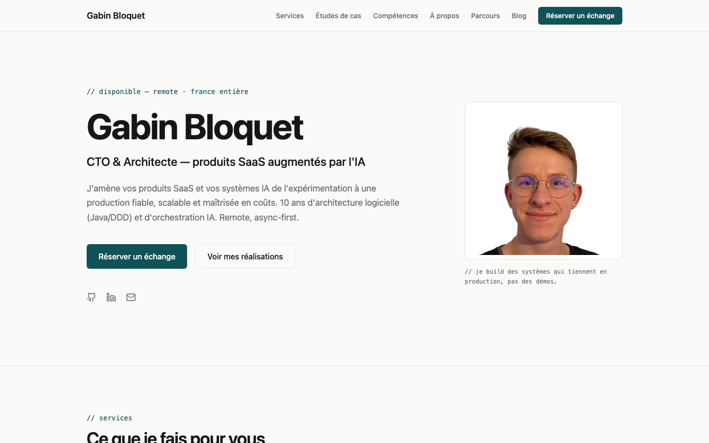

# Gabin Bloquet — site freelance

Site de Gabin Bloquet — **CTO & Architecte, produits SaaS augmentés par l'IA**.
Un site qui présente l'offre (cadrage IA → build → CTO fractionné), met en avant
des études de cas et pousse vers la réservation d'un échange.



🔗 [gabbloquet.github.io](https://gabbloquet.github.io)

## Stack technique

- **React 19** + TypeScript 6
- **Vite 8** (moteur Rolldown) — build tool
- **Tailwind CSS v4** (config CSS-first, tokens dans `src/index.css`)
- **React Router v7** — routing
- **React Markdown** + remark-gfm — rendu des articles de blog
- **lucide-react** — icônes (icônes de marques recréées dans `src/components/icons.tsx`)

## Design system — « Systems craft »

Near-monochrome + un seul accent, la sobriété comme message.

- **Couleurs** : `paper` `#FAFAF8`, `ink` `#16161A`, `muted` `#6B6B72`,
  `hairline` `#E4E4E0`, `accent` `#0F5257` (petrol, usage rare : CTA, liens, focus)
- **Typographie** : Space Grotesk (titres), Inter (corps), JetBrains Mono
  (eyebrows `// section`, stacks, métadonnées)
- **Layout** : filets fins plutôt que cartes colorées, whitespace généreux,
  sections uniformes séparées par des hairlines
- **Motion** : reveal sobre au scroll + rotation des témoignages, respect de
  `prefers-reduced-motion`

## Commandes

```bash
# Installation des dépendances
npm install

# Serveur de développement
npm run dev

# Build de production
npm run build

# Prévisualisation du build
npm run preview

# Linter
npm run lint
```

## Structure du projet

```
src/
├── components/      # Sections de la home (Hero, Services, CaseStudies,
│                    #   Testimonials, Skills, News, Resume, Contact, Footer…)
│   ├── SectionHeader.tsx  # En-tête commun (eyebrow mono + titre)
│   └── icons.tsx          # SVG GitHub/LinkedIn/Twitter inline
├── articles/        # Articles de blog en Markdown
├── constants.ts     # Email, URL Calendly, téléphone, localisation, liens
├── Home.tsx         # Page d'accueil (composition des sections)
├── Blog.tsx         # Liste des articles
├── Article.tsx      # Page article
└── main.tsx         # Point d'entrée avec routing
```

## Fonctionnalités

- **Offre** — section « Ce que je fais pour vous » : cadrage IA → build →
  direction technique fractionnée (CTO)
- **Études de cas** — format Problème → Ce que j'ai fait → Résultat
  (Justiana, Decathlon, Legipilot)
- **Compétences** — combo signature « Architecture + Orchestration IA »,
  forces en avant et inventaire complet repliable
- **Témoignages** — recommandations LinkedIn en rotation sobre
- **Blog** — articles avec recherche et filtres par catégorie
- **CTA « Réserver un échange »** — réservation directe via Calendly
  (repli email), URL centralisée dans `constants.ts`
- **CV téléchargeable** — export PDF via `window.print()` avec styles dédiés
- **Responsive** — mobile, tablette et desktop ; focus clavier visible, contraste AA

## Déploiement

Push sur `master` → déploiement automatique sur GitHub Pages
(`.github/workflows/deploy.yml`).

## Licence

MIT
